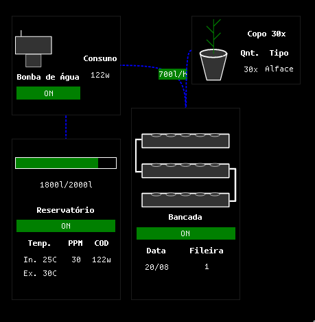

	

# Hidroponia React
**Overview de sistema hidropônico Esta em desenvolvimento!**

[Porque usar](#porque-usar) -
[Como usar](#como-usar) -
[Quando usar](#quando-usar) -
[Aonde usar](#aonde-usar)
 

## Pré-visualização

## Porque usar
- Focado em auxiliar no controle e visualização do sistema hidropônico

## Como usar
1. Clone o repositório
    - `git clone https://github.com/renatonunes74/hidroponia_react`
2. Entre na pasta
    - `cd hidroponia_react`
3. Instale os módulos
	- `npm i`
4. Rode localmente
    - CLI / via Terminal:
        - `npm start`
5. Agora é só acessar via navegador o endereço: `localhost:3000`

### Funcionalidades
- [ ] Ligar e desligar sistemas integrados
- [ ] Log's dinâmicos

### Dependências necessárias
- [Node](https://dev.java/)

### Tecnologias usadas
- Bibliotecas:
	- [React](https://projectlombok.org/) 
	- [React Grid Layout](https://projectlombok.org/) 
	- [Xarrows Grid Layout](https://projectlombok.org/) 

## Quando usar
- Quando precisar fazer manutenção, visualização da horta hidropônica.
## Aonde usar
- A aplicação esta em desenvolvimento mas por enquanto utilizara do ESP32 e uma API Java.

## Contribuição
Estou aberto a contribuições, feedback e opiniões da comunidade! Se você tiver alguma ideia para melhorar o projeto, correções de bugs ou sugestões de novos recursos, ficarei feliz em receber sua contribuição! Basta enviar um Pull Request no repositório do projeto.
